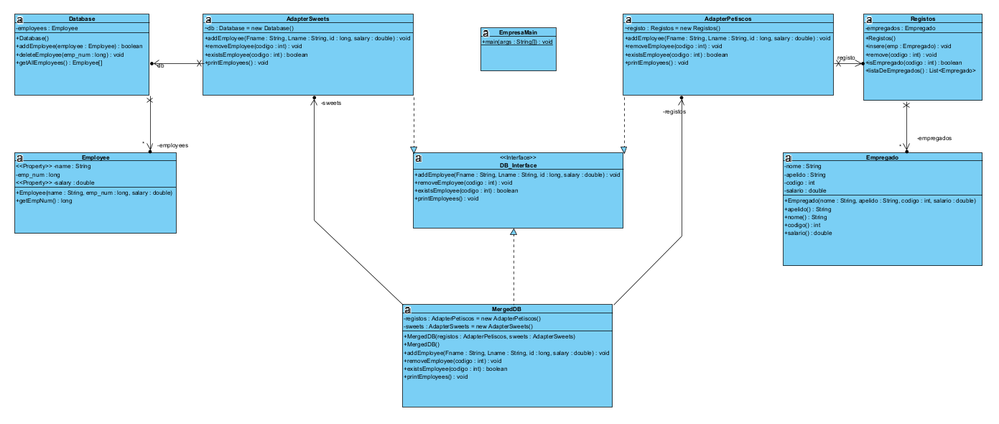
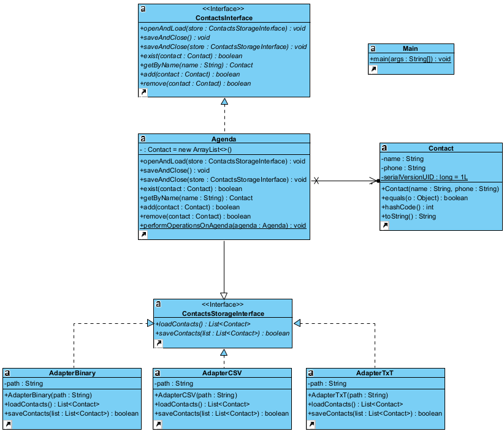
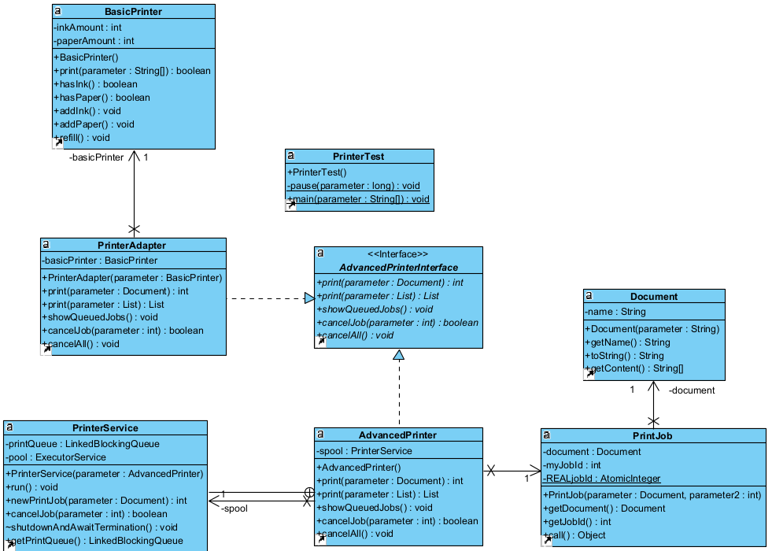

# Aula07 - Notes

To execute our code, you need to be outside lab07

# For Exercise 1 execute the following commands:

    javac lab07\Empresa_Pst\*.java

    java lab07/Empresa_Pst/EmpresaMain    

# For Exercise 2 execute the following commands:

    javac lab07\Contactos\*.java -Xlint

    java lab07/Contactos/Main

# To run the AdapterJSON uncomment everything about the JSON on the code and execute the following command: 

    javac lab07\Contactos*.java -cp .\lab07\Contactos\json-simple-1.1.1.jar

# For Exercise 3 execute the following commands:

    javac lab07\Impressora\*.java

    java lab07/Impressora/PrinterTest

