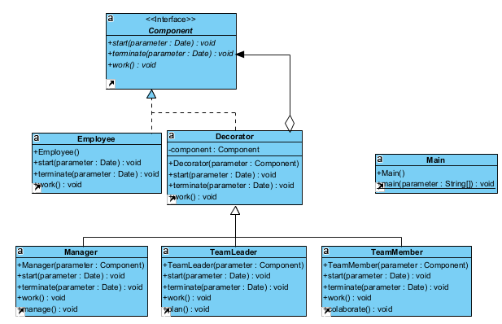
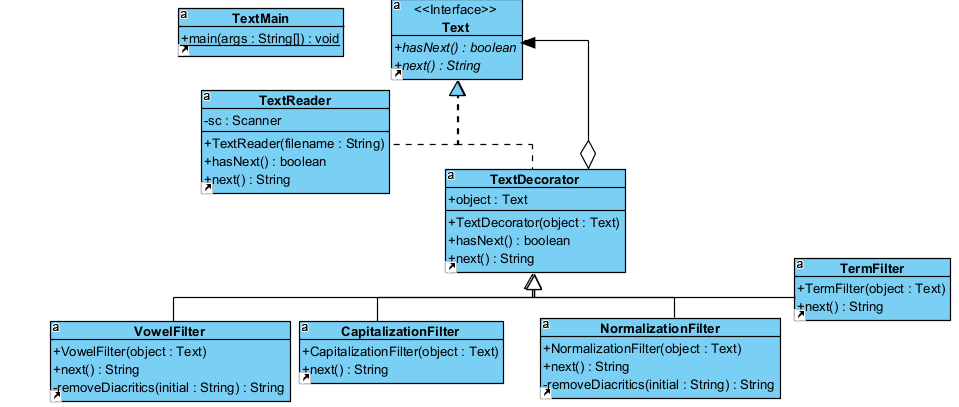
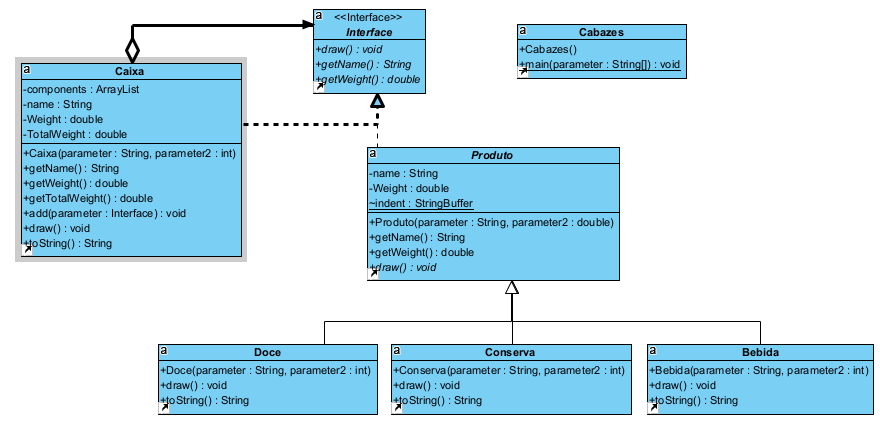

# Aula08 - Notes

To execute our code, you need to be outside lab08

# For Exercise 1 execute the following commands:

    javac lab08\TodosFazem\*.java

    java lab08/TodosFazem/Main    

# For Exercise 2 execute the following commands:

    javac lab08\TextProcess\*.java

    java lab08/TextProcess/Main

# For Exercise 3 execute the following commands:

    javac lab08\Cabazes\*.java

    java lab08/Cabazes/Cabazes

