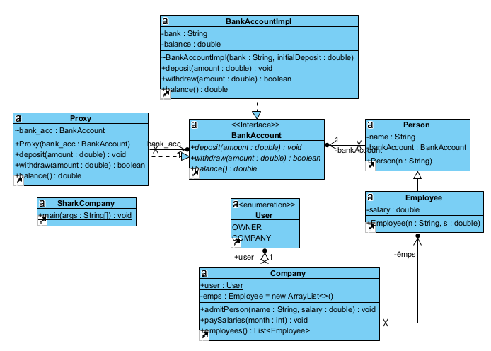
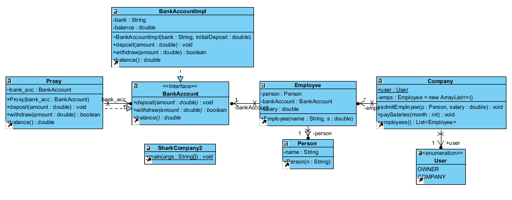
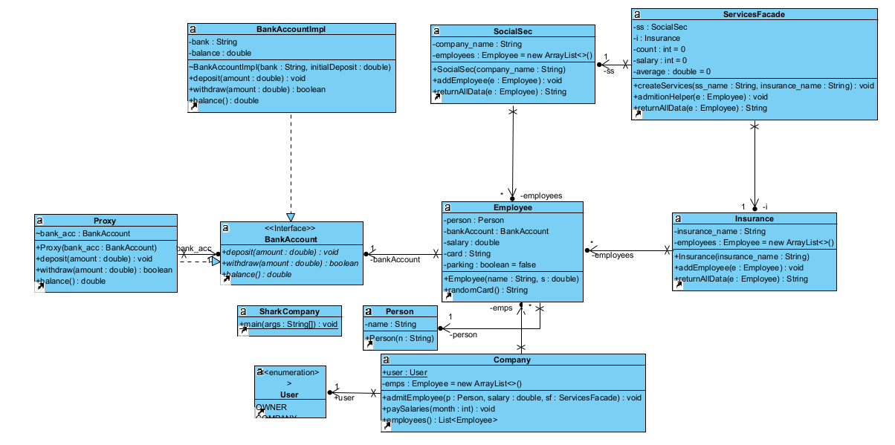
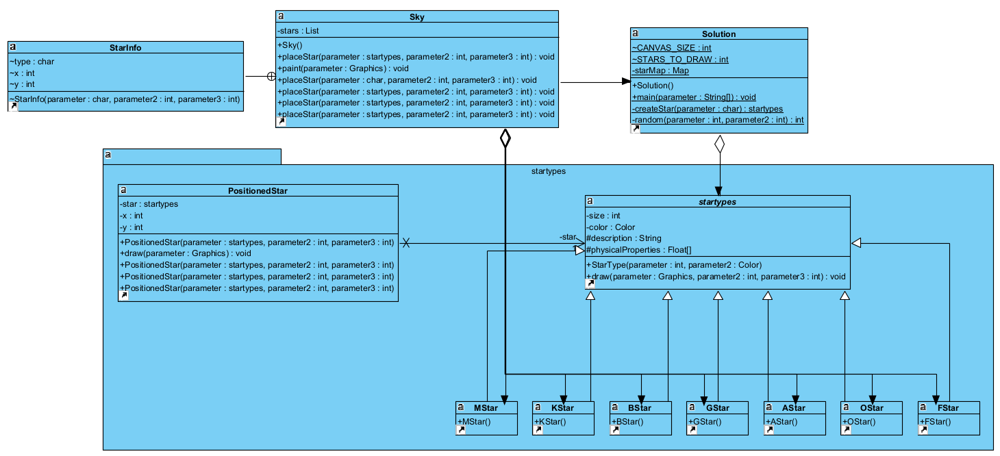

# Aula09 - Notes

To execute our code, you need to be outside lab09

# For Exercise 1 execute the following commands:

    a)

    javac lab09\ex1_a\*.java

    java lab09/ex1_a/SharkCompany    

    b)

    javac lab09\ex1_b\*.java

    java lab09/ex1_b/SharkCompany2

# For Exercise 2, execute the following commands:
 
    javac lab09\ex2\*.java

    java lab09/ex2/SharkCompany

# For Exercise 3, execute the following commands:

    javac lab09\ex3\*.java

    java lab09/ex3/Solution

