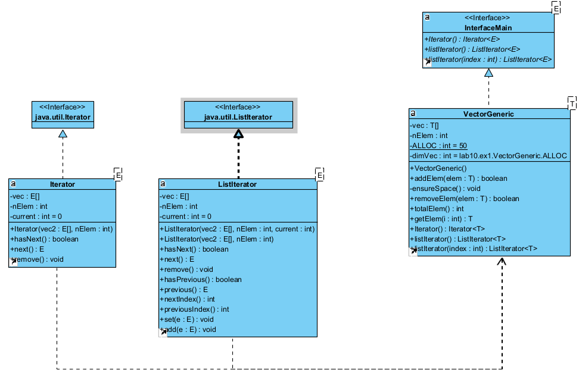
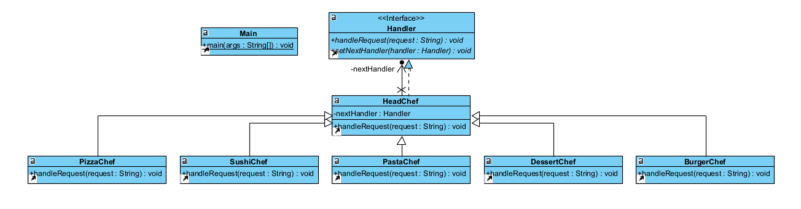
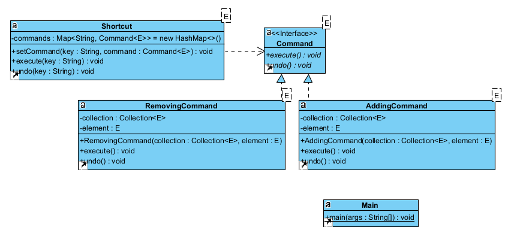

# Aula10 - Notes

To execute our code, you need to be outside lab10

# For Exercise 1 execute the following commands:

    javac lab10\ex1\*.java

    java lab10/ex1/Main

# For Exercise 2 execute the following commands:

    javac lab10\ex2\*.java

    java lab10/ex2/Main

# For Exercise 3 execute the following commands:

    javac lab10\ex3\*.java

    java lab10/ex3/Main

