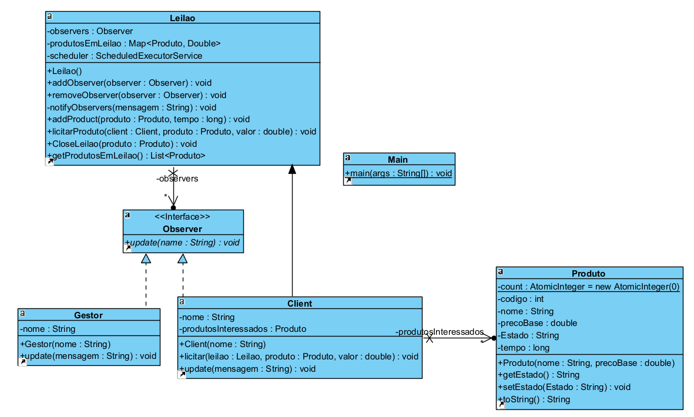
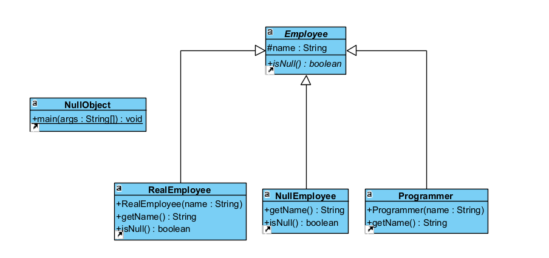
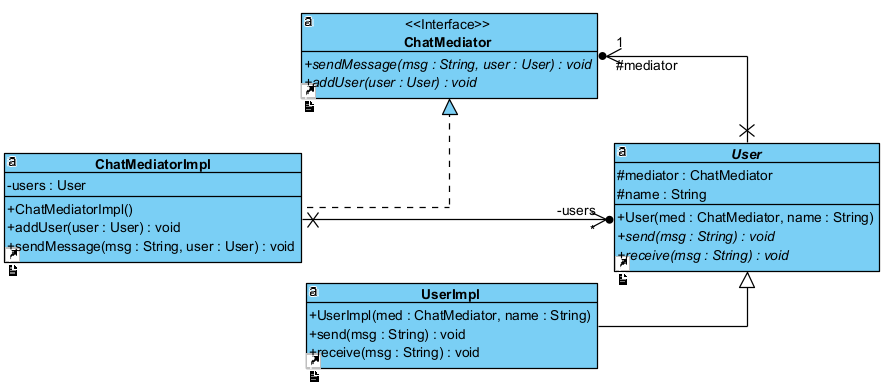

# Aula11 - Notes

To execute our code, you need to be outside lab11

# For Exercise 1 execute the following commands:

    javac lab11\ex1\*.java

    java lab11/ex1/Main

# For Exercise 2 execute the following commands:

    javac lab11\ex2\*.java

    java lab11/ex2/NullObject

# For Exercise 3 execute the following commands:

    javac lab11\ex3\*.java

    java lab11/ex3/Main

