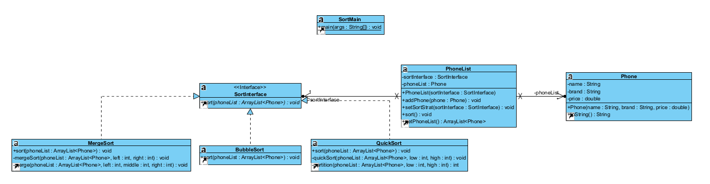
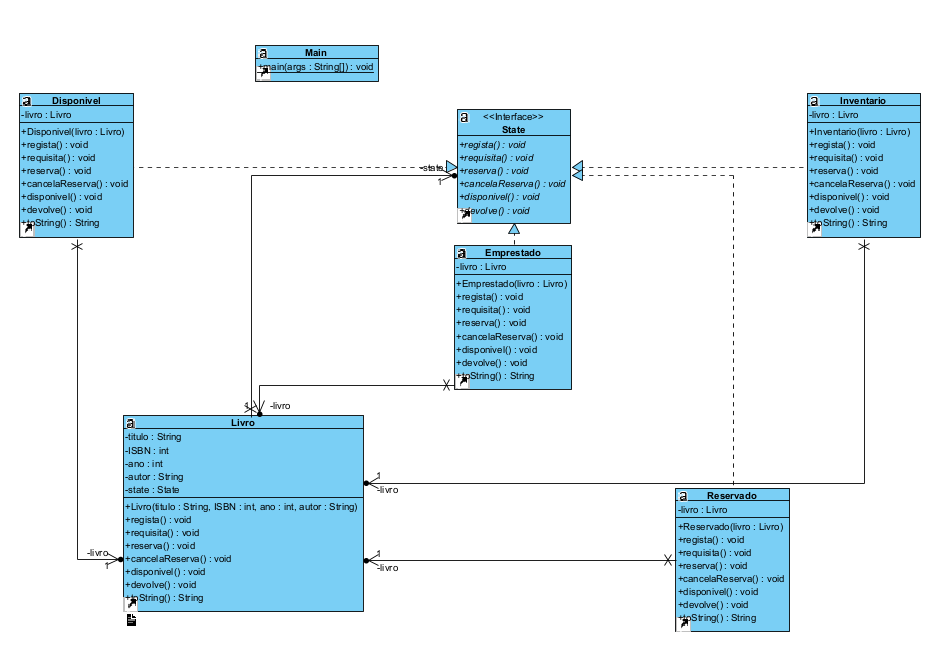
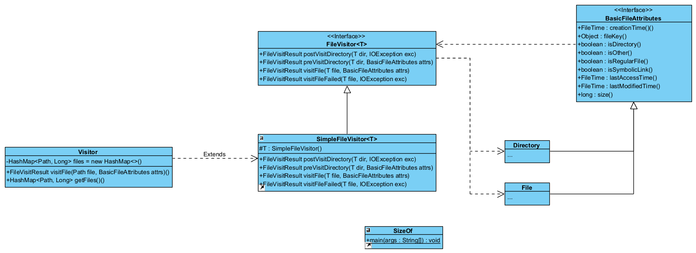

# Aula12 - Notes

To execute our code, you need to be outside lab12

# For Exercise 1 execute the following commands:

    javac lab12\ex1\*.java

    java lab12/ex1/SortMain

# For Exercise 3 execute the following commands:

    javac lab12\ex3\*.java

    java lab12/ex3/Main

# For Exercise 5 execute the following commands:

    javac lab12\ex5\*.java

    java lab12/ex5/SizeOf <<path>> | java lab12/ex5/SizeOf -r <<path>>

